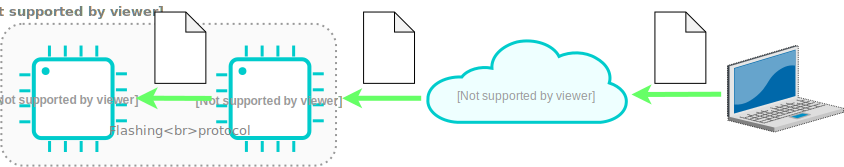

# Continuous hardware test guide

This guide explains how to implement a continous integration
hardware test for microcontrollers (hardware CI). It is a continuation to my
[bare metal programming guide](https://github.com/cpq/bare-metal-programming-guide).

## Overview

Those companies who develop microcontroller-based products, must test every
change that goes into the firmware source code. On every change,

- device firmware should build successfully (software CI)
- built firmware should run successfully on a real target hardware (hardware CI)

We should be able to flash a built firmware on a target device.
We should be able to collect target's debug output in order to decide,
did firmware run successfully or not. If we can do it remotely in an
automated way, then we can reflash and test firmware binaries from any
software CI of our choice - Github Actions, Jenkins, or others.

And there is a simple and inexpensive way to do it using the https://vcon.io
service:

1. Take any ESP32 or ESP32C3 device (e.g. any inexpensive development board)
2. Flash a pre-built firmware on it, turning ESP32 into a remotely-controlled programmer
3. Wire ESP32 to your target device: SWD pins for flashing, UART pins for capturing output
4. Configure ESP32 to register on https://dash.vcon.io management dashboard

When done, your target device will have an authenticated, secure RESTful
API for reflashing and capturing device output. It can be called from anywhere,
for example from the software CI:



The [vcon.io](https://vcon.io) service is run by Cesanta - the company I work
for. It is a paid service with a freebie quota: if you have just a few devices
to manage, it is completely free.

## Configuring and wiring ESP32

Take any ESP32 or ESP32C3 device - a devboard, a module, or your custom device.
Our recommendation is ESP32C3 XIAO devboard
([buy on Digikey](https://www.digikey.ie/en/products/detail/seeed-technology-co-ltd/113991054/16652880))
because of its low price (about 5 EUR) and small form factor.

We're going to assume that the target device is a Raspberry Pi
[W5500-EVB-Pico](https://docs.wiznet.io/Product/iEthernet/W5500/w5500-evb-pico)
board with a built-in Ethernet interface. If your device is different,
adjust the "Wiring" step according to your device's pinout.

- Follow [Flashing ESP32](https://vcon.io/docs/#flashing-esp32) to flash your ESP32
- Follow [Network Setup](https://vcon.io/docs/#network-setup) to register ESP32 on https://dash.vcon.io
- Follow [Wiring](https://vcon.io/docs/#quick-start-guide) to wire ESP32 to your device

Now, you can reflash your device with a single command:

```sh
curl -su :$API_KEY 'https://dash.vcon.io/api/v3/devices/$ID/ota' --data-binary @fw.bin
```

Where `$API_KEY` is the dash.vcon.io authentication key, `$ID` is the
registered device number, and `fw.bin` is the name of the newly built firmware.
You can find out both by clicking on the "action" -> "copy API command to
clipboard" on a dash.vcon.io dashboard.

We can also capture device output with a single command: 

```sh
curl -su :$API_KEY 'https://dash.vcon.io/api/v3/devices/$ID/tx?t=5'
```

There, `t=5` means wait 5 seconds while capturing UART output.

Now, we can use those two commands in any software CI platform to test a new
firmware on a real device, and test device's UART output against some expected
keywords. 

## Integrating with Github Actions

If you host your firmware project on Github, it is very easy to implement
an automatic firmware build. Just create a `.github` directory with a
YAML file that describes Github Actions workflow. For example,
[bare metal programming guide](https://github.com/cpq/bare-metal-programming-guide)
first [installs an ARM GCC compiler](https://github.com/cpq/bare-metal-programming-guide/blob/b0820b5c62b74a9b4456854feb376cda8cde4ecd/.github/workflows/test.yml#L9),
and then for every example,
[runs make command](https://github.com/cpq/bare-metal-programming-guide/blob/b0820b5c62b74a9b4456854feb376cda8cde4ecd/.github/workflows/test.yml#L10-L18) that builds a firmware.

Okay, our software CI builds a firmware image for us. It would be nice to
test that firmware image on a real hardware. And now we can!
We should add few extra commands that use `curl` utility to send a built
firmware to the test board, and then capture its debug output.

A `curl` command requires a secret API key, which we do not want to expose to
the public. The right way to go is to:
1. Go to the project settings / Secrets / Actions
2. Click on "New repository secret" button
3. Give it a name, `VCON_API_KEY`, paste the value into a "Secret" box, click "Add secret"

One of the example projects builds firmware for the RP2040-W5500 board, so
let's flash it using a `curl` command and a saved API key. The best way is
to add a Makefile target for testing, and let Github Actions (our software CI)
call it:
[.github/workflows/test.yml](https://github.com/cpq/bare-metal-programming-guide/blob/8d419f5e7718a8dcacad2ddc2f899eb75f64271e/.github/workflows/test.yml#L18)

Note that we pass a `VCON_API_KEY` environment variable to `make`. Also note
that we're invoking `test` Makefile target, which should build and test our
firmware. Here is the `test` Makefile target:
[step-7-webserver/pico-w5500/Makefile](https://github.com/cpq/bare-metal-programming-guide/blob/4fd72e67c380e3166a25c27b47afb41d431f84b9/step-7-webserver/pico-w5500/Makefile#L32-L37)

Explanation:
- line 34: The `test` target depends on `build`, so we always build firmware
  before testing
- line 35: We flash firmware remotely. The `--fail` flag to `curl` utility
  makes it fail if the response from the server is not successful (not HTTP 200
  OK)
- line 36: Capture UART log for 5 seconds and save it to `/tmp/output.txt`
- line 37: Search for the string `Ethernet: up` in the output, and fail if it
  is not found

Done! Now, our automatic tests ensure that the firmware can be built, that is
it bootable, that it initialises the network stack correctly.  This mechanism
can be easily extended: just add more complex actions in your firmware binary,
print the result to the UART, and check for the expected output in the test.

Happy testing!

## About the author

I am Sergey Lyubka, an engineer and entrepreneur. I hold MSc in RadioPhysics
and Electronics from Kyiv State University, Ukraine. I am a director and
co-founder at Cesanta - a technology company based in Dublin, Ireland.

My passion is bare metal embedded programming and embedded network
programming.  My company develops an open source, embedded [HTTP/MQTT/Websocket
network library](https://mongoose.ws).

I am open to give talks on embedded network programming - so [please
contact](https://mongoose.ws/contact/) if you'd like me to talk for your
company's development team, or at your university.

Thank you!
